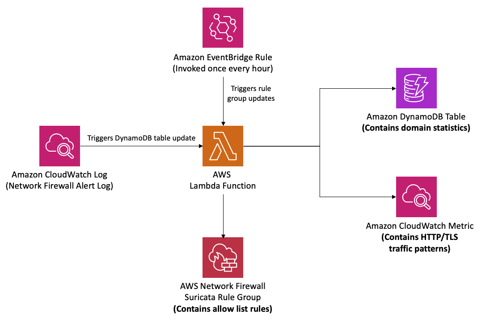
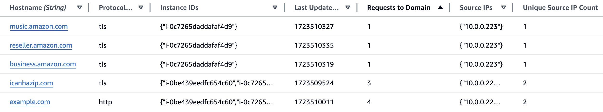
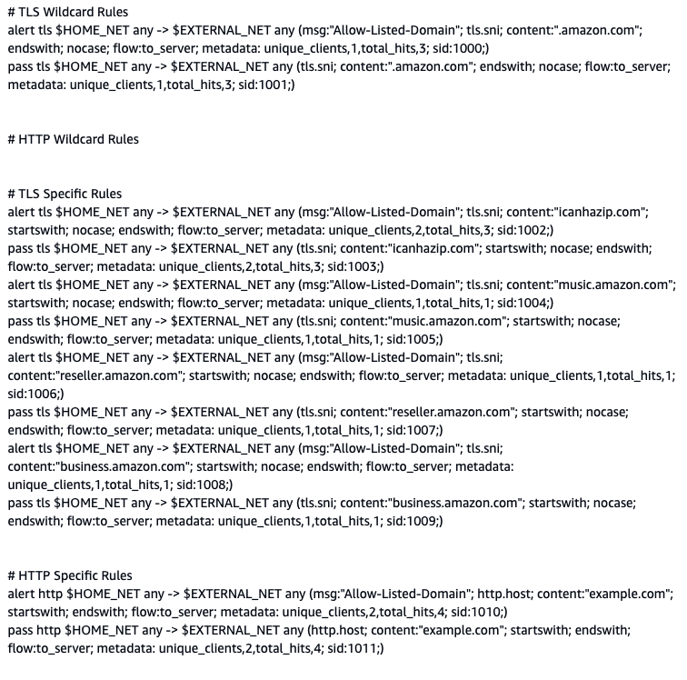
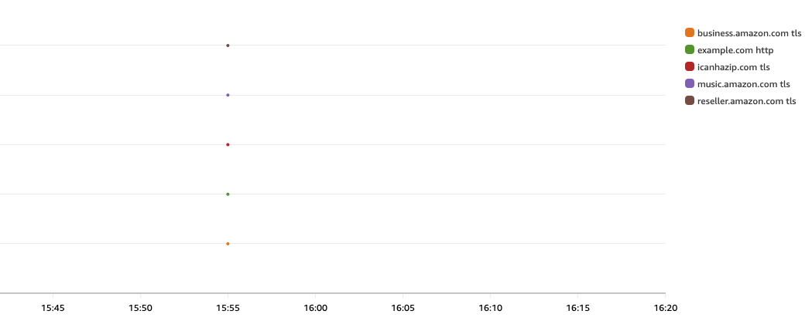

# AWS Network Firewall Allow List Automation

This repository contains an AWS CloudFormation template that helps automate the allow list creation process for AWS Network Firewall based on network traffic logs. The solution analyzes the Network Firewall alert logs in Amazon CloudWatch Logs, identifies the Server Name Indication (SNI) values associated with TLS traffic + the hostname associated with HTTP traffic and generates the corresponding allow rules in Suricata format. 

This solution is intended to help with building an allow list-based architecture for controlling outbound HTTP/TLS traffic from your workloads. It is not a fully automated solution, but rather a tool to surface the domains your workloads are reaching via HTTP/TLS, which can then be used to build out allow list rules. While this solution does not provide a fully automated allow list configuration, it aims to simplify the process of building and maintaining an allow list by providing visibility into the domains being accessed and generating rule recommendations based on the observed traffic patterns.

## Architecture

## Overview
The CloudFormation template creates the following resources:

1. **Amazon CloudWatch Log Subscription Filter**: Sends Network Firewall alert logs to the Lambda function for processing.
2. **Amazon CloudWatch Metrics**: Publishes CloudWatch metrics for each domain, protocol, and firewall combination. This allows you to monitor and visualize the network traffic patterns for your workloads.
2. **Amazon EventBridge Rule**: Triggers the Lambda function periodically (every hour by default) to update the Network Firewall rule group with the latest allow list rules.
3. **AWS Lambda Function**: Processes the Network Firewall alert logs and updates the DynamoDB table + CloudWatch metric, as well as generates the Suricata allow list rules.
4. **Amazon DynamoDB Table**: Stores the domains and associated metrics (unique source IP addresses + EC2 instance IDs requesting domain and total number of requests to domain) from the Network Firewall logs.
5. **AWS Network Firewall Rule Group**: Stores the generated allow list rules based on the domain values and metrics. Rules are ordered by number of requests to each domain, with the most requested domains appearing at the top of each rule group section. This rule group consists of four different sections:
      - **TLS Wildcard Rules**: This section contains wildcard TLS rules for domains that have reached the configured threshold of subdomains (defined by the WildcardDomainMinimum parameter).
      - **HTTP Wildcard Rules**: This section contains wildcard HTTP rules for domains that have reached the configured threshold of subdomains (defined by the WildcardDomainMinimum parameter).
      - **TLS Specific Rules**: This section contains TLS rules for every specific domains that has been reached. 
      - **HTTP Specific Rules**: This section contains HTTP rules for each specific domains that has been reached.

**Note:** This solution does not automatically attach the created rule groups to a Network Firewall policy. It is up to the user to decide how they want to use the rule groups generated by this solution. The user is responsible for attaching the relevant rule groups to their Network Firewall policies as needed.

## Before You Begin

The provided CloudFormation template makes the following three assumptions:

1.  You have already configured an AWS Network Firewall in your VPC
2.  Your AWS Network Firewall has been configured to publish firewall alert logs to a CloudWatch log group 
3.  Your AWS Network Firewall has the stateful rule group default action of "Alert Established"

If you have not deployed AWS Network Firewall in your VPC, you can use one of the available [AWS Network Firewall Deployment Architecture](https://github.com/aws-samples/aws-networkfirewall-cfn-templates) templates to create a firewall.  Once created, configure a [CloudWatch log group](https://docs.aws.amazon.com/AmazonCloudWatch/latest/logs/Working-with-log-groups-and-streams.html) for the firewall alert logs, and configure your AWS Network Firewall to use the "Alert Established" default action mentioned above. 

## Setup 

1. Deploy the CloudFormation stack in your AWS account using the provided template.
2. Specify the required parameters during the stack deployment:
   - `NetworkFirewallLogGroupName`: The name of the CloudWatch Logs log group containing your Network Firewall logs.
   - `RuleGroupCapacity`: The maximum number of rules allowed in the Network Firewall rule group (default: 1000).
   - `RuleSidPrefix`: The prefix for the rule SIDs to ensure uniqueness across rule groups (default: 1).
   - `RuleGroupName`: The name of the Network Firewall rule group (default: "StrictAllowListRuleGroup").
   - `CloudWatchMetricsNamespace`: The namespace for the CloudWatch metrics.
   - `RateInMinutes`: The rate (in minutes) at which the Lambda function will be invoked to update the Network Firewall rule group. This value must be greater than 1. (Default is every 60 minutes).
   - `AlertMessage`: The message used in the alert rules (default: "Allow-Listed-Domain").
   - `WildcardDomainMinimum`: Minimum number of subdomains reached before a wildcard rule is added to allow all subdomains for the corresponding domain (default: 15). For example, if this value is set to 15, once 15 different subdomains under the same domain are reached, a rule will be added to the WildcardAllowListRuleGroup to allow the entire domain and any subdomains.
3. After successful deployment, the stack will start processing the Network Firewall logs and updating the DynamoDB table with domain values and metrics.
4. The EventBridge rule will trigger the Lambda function periodically (every hour by default) to update the Network Firewall rule group with the latest allow list rules based on the domain values and metrics in the DynamoDB table.

## Intended Usage
This solution is designed to help identify the domains that your workloads are reaching out to, and assist in building out the allow list rules for those domains. It does not automatically enforce or apply the generated rules; instead, it simply adds any domain your workloads request to the allow list rule group. **It is up to you as the user to review the generated rules and decide which domains you actually want to allow access to.**

## Example
To help better understand the solution, let's say this stack was deployed with the `WildcardDomainMinimum` set to 3. This means if my workloads reach 3 or more subdomains associated with the same domain via the same protocol (TLS or HTTP), that the entire domain will be added to the wildcard rule group section for that protocol. 

In this example, the entire `amazon.com` is added to the TLS wildcard rule group section since 3 subdomains associated with that domain have been reached via TLS. (HTTP wildcard section functions the same way)

**Note:** In the CloudWatch metrics screenshot, I requested all the domains at the same time. For normal traffic patterns, these points would be more scatterred around the graph at the specific time the domains were requested. 

### DynamoDB Table

### Allow List Rule Group

### CloudWatch Metrics

## Why Use This Solution?

This solution addresses several challenges and provides benefits in managing network traffic and security posture:

- **Reduce Attack Surface**: Domain-based allow lists with a default deny can offer significant risk mitigation. Rather than try to maintain a constantly updated list of all current and future potential threats to detect and block, it can be much simpler to limit application workloads to only communicate with the trusted domains that are necessary for their operation. Also, domain names (unlike IP addresses) change infrequently.

- **Visibility into Network Traffic**: By analyzing the Network Firewall logs, this solution provides valuable insights into the network traffic patterns, including the domains and subdomains being accessed, the timestamps of when they're being accessed, the information on which clients are accessing each domain, and the total requests to each domain. 

- **Lightweight and Non-Disruptive**: This solution does not require deploying additional Network Firewall resources or making changes to your existing Network Firewall configuration (besides ensuring 'Alert Established' is enabled and storing alert logs in a CloudWatch logs group). It seamlessly integrates with your existing Network Firewall deployment, leveraging the logs generated by the firewall to create the allow list rules.

- **Wildcard Domain Support**: The solution includes a support for domains with a large number of subdomains (configurable threshold), allowing for more efficient and manageable rule sets. 

## Limitations

- The maximum capacity for the Network Firewall rule group is 30,000 rules. However, due to the size of rule strings, this template has a lower default maximum capacity of 1,000 rules. This can be changed by editing the CloudFormation `RuleGroupCapacity` parameter.
- DynamoDB has a limit of 400 KB for the size of an item. This solution stores the list of source IP addresses and associated instance IDs for each SNI value in DynamoDB attributes. Assuming an average IP address string length of 15 characters (e.g., "192.168.1.100") and an average instance ID string length of 20 characters (e.g., "i-0c7265daddafaf4d9"), and considering the space required for other attributes, it's estimated that this solution can support approximately 15,000 unique source IP addresses and associated instance IDs per SNI value. If you anticipate a larger number of unique source IP addresses and instance IDs for a single SNI value, you may need to modify the solution to handle this case.

## Pricing Consideration

This solution assumes that you have already deployed AWS Network Firewall and configured it to publish firewall alert logs to a CloudWatch log group. The pricing for these services are not covered here.

The additional services introduced by this solution and their pricing models are:

- **AWS Lambda**: Refer to the [Lambda pricing](https://aws.amazon.com/lambda/pricing/) page for more details.
- **Amazon DynamoDB**: Refer to the [DynamoDB pricing](https://aws.amazon.com/dynamodb/pricing/) page for more details.
- **Amazon EventBridge**: Refer to the [EventBridge pricing](https://aws.amazon.com/eventbridge/pricing/) page for more details.
- **Amazon CloudWatch**: Refer to the [CloudWatch pricing](https://aws.amazon.com/cloudwatch/pricing/) page for more details. 

It's recommended to estimate the expected costs based on your specific usage patterns and requirements before deploying this solution.

## Cleanup

To remove the resources created by this template, delete the CloudFormation stack from the AWS Management Console or using the AWS CLI.

## Authors

|Name | Title|
|------|------|
|Bryan Van Hook | Solutions Architect III|
|Lawton Pittenger | Solutions Architect I|

## License

This project is licensed under the Apache-2.0 License.